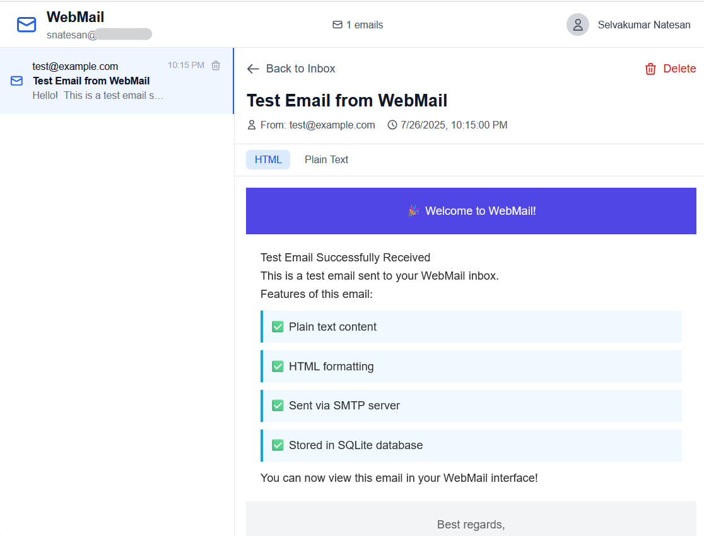

# Mock SMTP Server and webmail

A SMTP test application built with Go and Vue.js that acts as a SMTP server and provides a web interface for viewing emails. Meant to be used for testing email delivery and test environment.

## ✨ Features

- **📧 SMTP Server**: Listens on port 25 for incoming emails (no TLS required)
- **🌐 Web Interface**: Vue.js-based webmail with Tailwind CSS
- **🔐 OAuth Authentication**: Google OAuth integration for secure login
- **📁 Automatic Inbox Management**: Creates inboxes based on email addresses
- **🗑️ Email Operations**: View and delete emails with a modern interface
- **💾 SQLite Storage**: Lightweight database for email storage
- **📱 Responsive Design**: Works on desktop and mobile devices

## 🖼️ Screenshot



## 📝 How to use
```
docker run --rm                         \
    -v ./data:/data                     \
    -e DATABASE_URL=/data/mockmt.db     \
    -e SMTP_PORT=2525                   \
    -e PORT=8080                        \
    -e JWT_SECRET_KEY=s3cr3t            \
    -e OAUTH_CLIENT_ID=<client-id>      \
    -e OAUTH_CLIENT_SECRET=<secret>     \
    -e OAUTH_AUTH_URL=<url-/auth>       \
    -e OAUTH_TOKEN_URL=<url-/token>     \
    -e OAUTH_USERINFO_URL=<url-userinfo>\
    -e OAUTH_REDIRECT_URI=https://<APP-BASE-URL>/auth/callback  \
    ghcr.io/selvakn/mockmt:1.0.2
```
## 🛠️ Tech Stack

- **Backend**: Go with Gin framework
- **SMTP Server**: go-smtp library
- **Database**: SQLite with native Go drivers
- **Frontend**: Vue.js 3 with Composition API
- **Authentication**: OAuth with JWT tokens
- **Styling**: Tailwind CSS
- **Build Tool**: Vite

## 🚀 Quick Start

### Prerequisites

- Go 1.21+
- Node.js 16+
- OAuth IDP

### 1. Setup OAuth Server

1. Configure your OAuth server (e.g., Keycloak, Auth0, etc.)
2. Create a new OAuth client
3. Set the redirect URI to `http://localhost:8080/auth/callback`
4. Copy your Client ID and Client Secret
5. Note the OAuth endpoints (auth URL, token URL, userinfo URL)

### 2. Install and Setup

```bash
# Clone the repository
git clone <your-repo-url>
cd webmail

# Install Go dependencies
go mod tidy

# Install frontend dependencies
cd frontend
npm install
cd ..

# Copy environment file
cp env.example .env

# Edit the .env file with your Google OAuth credentials
nano .env
```

### 3. Configure Environment

Edit the `.env` file with your OAuth server credentials:

```env
OAUTH_CLIENT_ID=your_oauth_client_id_here
OAUTH_CLIENT_SECRET=your_oauth_client_secret_here
OAUTH_AUTH_URL=https://your-oauth-server/auth/realms/your-realm/protocol/openid-connect/auth
OAUTH_TOKEN_URL=https://your-oauth-server/auth/realms/your-realm/protocol/openid-connect/token
OAUTH_USERINFO_URL=https://your-oauth-server/auth/realms/your-realm/protocol/openid-connect/userinfo
OAUTH_REDIRECT_URI=http://localhost:8080/auth/callback
OAUTH_SCOPES=openid email profile
JWT_SECRET_KEY=your_jwt_secret_key_here
```

### 4. Start the Application

```bash
# Terminal 1: Start the backend (SMTP + API)
go run .

# Terminal 2: Start the frontend
cd frontend
npm run dev
```

### 5. Access the Application

- **Webmail Interface**: http://localhost:3000
- **API**: http://localhost:8080
- **SMTP Server**: localhost:25

## 📧 Testing the SMTP Server

### Using the Test Script

```bash
go run test_email.go
```

### Using Command Line

```bash
# Send a test email using telnet
telnet localhost 25
EHLO localhost
MAIL FROM: test@example.com
RCPT TO: your-email@localhost
DATA
Subject: Test Email
From: test@example.com
To: your-email@localhost

Hello! This is a test email.
.
QUIT
```

### Using Email Clients

Configure your email client to send emails to `localhost:25` with any recipient address ending in `@localhost`.

## 🎯 Usage

1. **Access the Webmail**: Go to http://localhost:3000
2. **Login with OAuth**: Click "Sign in with OAuth" and authenticate
3. **View Your Inbox**: Your emails will appear in the inbox matching your email address
4. **Read Emails**: Click on any email to view its contents
5. **Delete Emails**: Use the delete button to remove emails
6. **Send Test Emails**: Use the test script or any SMTP client to send emails to localhost:25


## 🔧 Configuration

### Environment Variables

| Variable | Description | Default |
|----------|-------------|---------|
| `OAUTH_CLIENT_ID` | OAuth Client ID | Required |
| `OAUTH_CLIENT_SECRET` | OAuth Client Secret | Required |
| `OAUTH_AUTH_URL` | OAuth authorization URL | Required |
| `OAUTH_TOKEN_URL` | OAuth token URL | Required |
| `OAUTH_USERINFO_URL` | OAuth userinfo URL | Required |
| `OAUTH_REDIRECT_URI` | OAuth redirect URI | `http://localhost:8080/auth/callback` |
| `OAUTH_SCOPES` | OAuth scopes | `openid email profile` |
| `JWT_SECRET_KEY` | JWT signing key | Required |
| `DATABASE_URL` | Database path | `./webmail.db` |
| `PORT` | Web server port | `8080` |
| `SMTP_PORT` | SMTP server port | `25` |
| `FRONTEND_URL` | Frontend URL | `http://localhost:3000` |

### Ports

- **25**: SMTP server (requires root/admin privileges) or `SMTP_PORT`
- **8080**: Go web server (`PORT`)
- **3000**: Vue.js frontend

## 🛡️ Security Notes

- The SMTP server only accepts emails for `@localhost` addresses
- OAuth authentication ensures only authorized users can access emails
- JWT tokens are used for session management
- Emails are soft-deleted (marked as deleted but not physically removed)

## 🐛 Troubleshooting

### SMTP Server Issues

If you can't bind to port 25:
```bash
# On Linux/Mac, run with sudo
sudo go run .

# Or change the port in the code
# Edit .env and set SMTP_PORT
SMTP_PORT=2525
```

### OAuth Issues

- Ensure redirect URI matches exactly: `http://localhost:8080/auth/callback`
- Check that your OAuth server is properly configured
- Verify Client ID and Secret are correct
- Ensure all OAuth endpoints (auth, token, userinfo) are accessible

### Database Issues

```bash
# Reset the database
rm webmail.db
go run .
```

## 🤝 Contributing

1. Fork the repository
2. Create a feature branch
3. Make your changes
4. Add tests if applicable
5. Submit a pull request

## 📄 License

This project is open source and available under the [MIT License](LICENSE).

## 🙏 Acknowledgments

- [Gin](https://gin-gonic.com/) for the web framework
- [go-smtp](https://github.com/emersion/go-smtp) for the SMTP server
- [Vue.js](https://vuejs.org/) for the frontend framework
- [Tailwind CSS](https://tailwindcss.com/) for styling 