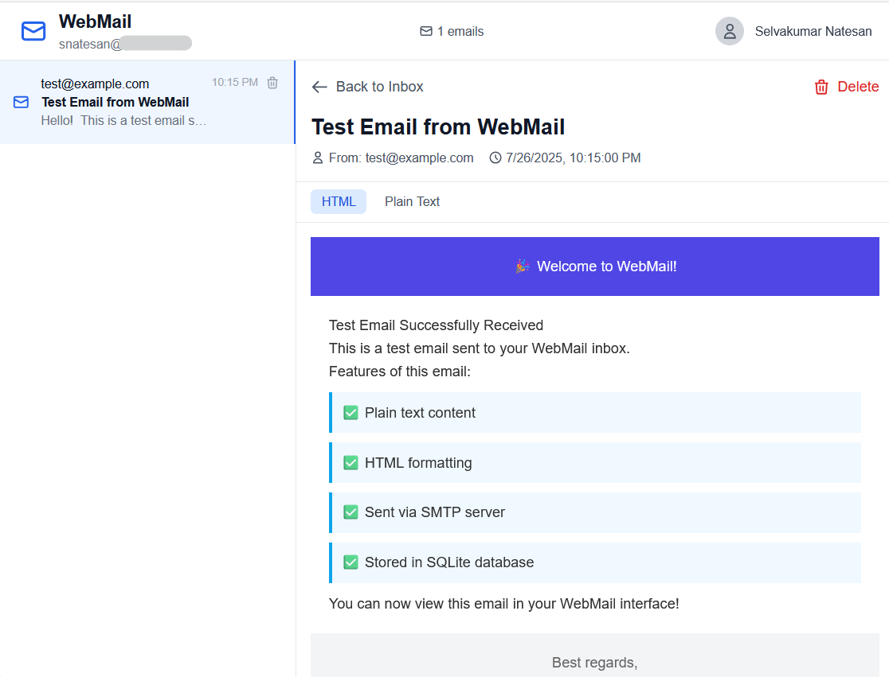

# Mock SMTP Server and webmail

A SMTP test application built with Go and Vue.js that acts as a SMTP server and provides a web interface for viewing emails. Meant to be used for testing email delivery and test environment.

It has two operating modes:

- **Capture-only** (the default): accepts mail, stores it, shows it in the webmail UI. Nothing ever leaves the system. This is the original mode described throughout this README.
- **Relay-with-approval** (opt-in): mail is held in a review queue instead of being delivered; an authorized reviewer inspects it in the portal and presses **Send Now** to relay it through a real upstream provider (e.g. Gmail). See [Relay Mode](#-relay-mode) below. This is meant for situations like an AI agent sending mail that must be reviewed by a human before it reaches a real recipient.

## ✨ Features

- **📧 SMTP Server**: Listens on port 25 for incoming emails (no TLS required for submission)
- **🔒 SMTP Authentication**: Requires a configured username/password (`AUTH PLAIN`) before accepting mail
- **🌐 Web Interface**: Vue.js-based webmail with Tailwind CSS
- **🔐 OAuth Authentication**: Google OAuth integration for secure login
- **📁 Automatic Inbox Management**: Creates inboxes based on email addresses
- **🗑️ Email Operations**: View and delete emails with a modern interface
- **💾 SQLite Storage**: Lightweight database for email storage
- **📱 Responsive Design**: Works on desktop and mobile devices
- **✅ Relay Mode (opt-in)**: hold mail for human review and approval before relaying it to a real upstream SMTP provider — see [Relay Mode](#-relay-mode)

## 🖼️ Screenshot



## 📝 How to use
```
docker run --rm                         \
    -v ./data:/data                     \
    -e DATABASE_URL=/data/mockmt.db     \
    -e SMTP_PORT=2525                   \
    -e SMTP_USERNAME=<smtp-username>    \
    -e SMTP_PASSWORD=<smtp-password>    \
    -e PORT=8080                        \
    -e JWT_SECRET_KEY=s3cr3t            \
    -e OAUTH_CLIENT_ID=<client-id>      \
    -e OAUTH_CLIENT_SECRET=<secret>     \
    -e OAUTH_AUTH_URL=<url-/auth>       \
    -e OAUTH_TOKEN_URL=<url-/token>     \
    -e OAUTH_USERINFO_URL=<url-userinfo>\
    -e OAUTH_REDIRECT_URI=https://<APP-BASE-URL>/auth/callback  \
    ghcr.io/selvakn/mockmt:1.0.2
```
## 🛠️ Tech Stack

- **Backend**: Go with Gin framework
- **SMTP Server**: go-smtp library
- **Database**: SQLite with native Go drivers
- **Frontend**: Vue.js 3 with Composition API
- **Authentication**: OAuth with JWT tokens
- **Styling**: Tailwind CSS
- **Build Tool**: Vite

## 🚀 Quick Start

### Prerequisites

- Go 1.21+
- Node.js 16+
- OAuth IDP

### 1. Setup OAuth Server

1. Configure your OAuth server (e.g., Keycloak, Auth0, etc.)
2. Create a new OAuth client
3. Set the redirect URI to `http://localhost:8080/auth/callback`
4. Copy your Client ID and Client Secret
5. Note the OAuth endpoints (auth URL, token URL, userinfo URL)

### 2. Install and Setup

```bash
# Clone the repository
git clone <your-repo-url>
cd webmail

# Install Go dependencies
go mod tidy

# Install frontend dependencies
cd frontend
npm install
cd ..

# Copy environment file
cp env.example .env

# Edit the .env file with your Google OAuth credentials
nano .env
```

### 3. Configure Environment

Edit the `.env` file with your OAuth server credentials:

```env
OAUTH_CLIENT_ID=your_oauth_client_id_here
OAUTH_CLIENT_SECRET=your_oauth_client_secret_here
OAUTH_AUTH_URL=https://your-oauth-server/auth/realms/your-realm/protocol/openid-connect/auth
OAUTH_TOKEN_URL=https://your-oauth-server/auth/realms/your-realm/protocol/openid-connect/token
OAUTH_USERINFO_URL=https://your-oauth-server/auth/realms/your-realm/protocol/openid-connect/userinfo
OAUTH_REDIRECT_URI=http://localhost:8080/auth/callback
OAUTH_SCOPES=openid email profile
JWT_SECRET_KEY=your_jwt_secret_key_here
SMTP_USERNAME=your_smtp_username_here
SMTP_PASSWORD=your_smtp_password_here
```

The SMTP server requires `SMTP_USERNAME` and `SMTP_PASSWORD` to be set — it will refuse to start otherwise.

### 4. Start the Application

```bash
# Terminal 1: Start the backend (SMTP + API)
go run .

# Terminal 2: Start the frontend
cd frontend
npm run dev
```

### 5. Access the Application

- **Webmail Interface**: http://localhost:3000
- **API**: http://localhost:8080
- **SMTP Server**: localhost:25

## 📧 Testing the SMTP Server

### Using the Test Script

```bash
go run ./cmd/test_email
```

You'll be prompted for the recipient address and your configured `SMTP_USERNAME`/`SMTP_PASSWORD`.

### Using Command Line

The server requires authentication, so a plain `telnet` session must issue `AUTH PLAIN` (base64-encoded `\0username\0password`) before `MAIL FROM` will be accepted. It's easier to test with an SMTP client library, e.g. Go's standard library:

```go
auth := smtp.PlainAuth("", "your_smtp_username", "your_smtp_password", "localhost")
smtp.SendMail("localhost:25", auth, "test@example.com", []string{"your-email@localhost"}, message)
```

### Using Email Clients

Configure your email client to send emails to `localhost:25` using your configured `SMTP_USERNAME`/`SMTP_PASSWORD`, with any recipient address ending in `@localhost`.

## 🔁 Relay Mode

Relay mode turns this from a mock server into a real relay, gated behind a human. It is off by default — a deployment that sets none of the `RELAY_*` variables below behaves exactly as described everywhere else in this README, and cannot deliver mail anywhere.

**The idea**: an automated sender (an AI agent, a script, anything speaking SMTP) submits mail exactly as it always has. Instead of being delivered, the message is parked in a review queue. A reviewer signs into the portal, opens the message — full body, HTML rendered in an isolated sandbox, attachments previewable or downloadable — and either presses **Send Now** (relays it through a real upstream provider) or **Reject** (it is never delivered). Every decision is attributed and permanently audited.

### Enabling it

Add to your `.env` (see `env.example` for the full list with defaults):

```env
RELAY_ENABLED=true
RELAY_HOST=smtp.gmail.com
RELAY_PORT=587
RELAY_TLS_MODE=starttls
RELAY_USERNAME=you@gmail.com
RELAY_PASSWORD=your_16_char_app_password
RELAY_IDENTITY=you@gmail.com
REVIEWER_EMAILS=alice@example.com,bob@example.com
```

For Gmail specifically: you need an **App Password**, which requires 2-Step Verification on the account — an ordinary account password will be refused. `REVIEWER_EMAILS` must match the address your OAuth provider returns at login.

If `RELAY_ENABLED=true` but any required setting is missing — including an empty `REVIEWER_EMAILS`, since nobody could release queued mail — the process refuses to start and reports every missing setting at once, rather than starting into a state where approvals would silently fail.

### What a reviewer sees and does

Once enabled, an authorized reviewer sees a **Relay mode: ON** indicator and a **Review Queue** link in the header. The queue shows every pending message instance-wide (not scoped to any one recipient). Opening a message shows:

- the sender the agent actually used, alongside the identity that will replace it in `From` when relayed;
- every **envelope** recipient — including any Bcc'd address, explicitly flagged as hidden from the other recipients, so nothing can be delivered to an address the reviewer never saw;
- the message body, with the HTML version rendered in a sandboxed, script-free iframe;
- attachments, previewable inline for images/PDF/plain text and downloadable for everything else.

Pressing **Send Now** relays synchronously — the response tells the reviewer whether it was delivered, and if not, whether the failure is safely retriable (**confirmed**: nothing went out) or came back with an unknown outcome (**indeterminate**: the message was transmitted but the acknowledgement never arrived). Retrying an indeterminate failure requires the reviewer to explicitly accept that a duplicate might be delivered.

### Behind the scenes

- The relayed `From` is always the configured `RELAY_IDENTITY`; the original sender is preserved in `Reply-To` (unless the sender already set one) so replies still reach them, and in the audit trail so attribution is never lost.
- Relaying never creates a portal user account for an external recipient — queued messages have no owning user at all, and capture-only mode's existing behavior is completely unaffected.
- All relay connections are encrypted (STARTTLS or implicit TLS) — there is no plaintext relay option.
- Memory is bounded: the SQLite driver has no incremental blob I/O, so a whole message is held in memory per operation. `SMTP_MAX_CONCURRENT` and `RELAY_MAX_CONCURRENT_IO` cap how many such operations run at once; an inbound connection over the cap gets a standard, immediately retryable `421` rather than hanging.
- Optional retention (`RETENTION_DAYS`, disabled by default) purges the *content* of messages that have reached a final state (sent/rejected) after N days, while keeping their metadata and full audit history forever. Pending or unresolved-failed messages are never purged regardless of age.

Full configuration reference, the memory-sizing formula, and a step-by-step walkthrough live in [`specs/002-smtp-relay-approval/quickstart.md`](specs/002-smtp-relay-approval/quickstart.md).

## 🎯 Usage

1. **Access the Webmail**: Go to http://localhost:3000
2. **Login with OAuth**: Click "Sign in with OAuth" and authenticate
3. **View Your Inbox**: Your emails will appear in the inbox matching your email address
4. **Read Emails**: Click on any email to view its contents
5. **Delete Emails**: Use the delete button to remove emails
6. **Send Test Emails**: Use the test script or any SMTP client to send emails to localhost:25


## 🔧 Configuration

### Environment Variables

| Variable | Description | Default |
|----------|-------------|---------|
| `OAUTH_CLIENT_ID` | OAuth Client ID | Required |
| `OAUTH_CLIENT_SECRET` | OAuth Client Secret | Required |
| `OAUTH_AUTH_URL` | OAuth authorization URL | Required |
| `OAUTH_TOKEN_URL` | OAuth token URL | Required |
| `OAUTH_USERINFO_URL` | OAuth userinfo URL | Required |
| `OAUTH_REDIRECT_URI` | OAuth redirect URI | `http://localhost:8080/auth/callback` |
| `OAUTH_SCOPES` | OAuth scopes | `openid email profile` |
| `JWT_SECRET_KEY` | JWT signing key | Required |
| `DATABASE_URL` | Database path | `./webmail.db` |
| `PORT` | Web server port | `8080` |
| `SMTP_PORT` | SMTP server port | `25` |
| `SMTP_USERNAME` | SMTP `AUTH PLAIN` username | Required |
| `SMTP_PASSWORD` | SMTP `AUTH PLAIN` password | Required |
| `FRONTEND_URL` | Frontend URL | `http://localhost:3000` |
| `RELAY_ENABLED` | Enable relay-with-approval mode | `false` |
| `RELAY_HOST` | Upstream SMTP host | Required if `RELAY_ENABLED=true` |
| `RELAY_PORT` | Upstream SMTP port | `587` |
| `RELAY_TLS_MODE` | `starttls` or `tls` (no plaintext option) | `starttls` |
| `RELAY_USERNAME` | Upstream SMTP username | Required if `RELAY_ENABLED=true` |
| `RELAY_PASSWORD` | Upstream SMTP password (e.g. a Gmail App Password) | Required if `RELAY_ENABLED=true` |
| `RELAY_IDENTITY` | Address relayed mail's `From` is rewritten to | Required if `RELAY_ENABLED=true` |
| `RELAY_TIMEOUT_SECONDS` | Per-attempt delivery timeout | `10` |
| `RELAY_CA_CERT_FILE` | Extra CA cert for a self-hosted upstream | Optional |
| `REVIEWER_EMAILS` | Comma-separated list of addresses allowed to review/send/reject | Required (non-empty) if `RELAY_ENABLED=true` |
| `MAX_MESSAGE_BYTES` | Maximum accepted message size | `26214400` (25 MB) |
| `SMTP_MAX_CONCURRENT` | Max concurrent inbound SMTP connections | `3` |
| `SMTP_READ_TIMEOUT_SECONDS` | Inbound SMTP idle read timeout | `60` |
| `SMTP_WRITE_TIMEOUT_SECONDS` | Inbound SMTP idle write timeout | `60` |
| `RELAY_MAX_CONCURRENT_IO` | Max concurrent whole-message reads (send/preview/download) | `2` |
| `RETENTION_DAYS` | Days after which terminal messages' content is purged; `0` disables purging | `0` |

### Ports

- **25**: SMTP server (requires root/admin privileges) or `SMTP_PORT`
- **8080**: Go web server (`PORT`)
- **3000**: Vue.js frontend

## 🛡️ Security Notes

- The SMTP server requires `AUTH PLAIN` authentication with the configured `SMTP_USERNAME`/`SMTP_PASSWORD` before it will accept any mail; the server refuses to start if these are not configured
- Credentials are sent in plaintext (no STARTTLS/TLS) — only expose the SMTP port on trusted/internal networks
- The SMTP server only accepts emails for `@localhost` addresses
- OAuth authentication ensures only authorized users can access emails
- JWT tokens are used for session management
- Emails are soft-deleted (marked as deleted but not physically removed)
- With relay mode enabled: upstream credentials are never exposed via the portal, any API response, or log output; only authenticated users whose address appears in `REVIEWER_EMAILS` can view the review queue or act on it — including for a message addressed to their own account; and all connections to the upstream provider are encrypted (no plaintext relay option)

## 🐛 Troubleshooting

### SMTP Server Issues

If you can't bind to port 25:
```bash
# On Linux/Mac, run with sudo
sudo go run .

# Or change the port in the code
# Edit .env and set SMTP_PORT
SMTP_PORT=2525
```

### OAuth Issues

- Ensure redirect URI matches exactly: `http://localhost:8080/auth/callback`
- Check that your OAuth server is properly configured
- Verify Client ID and Secret are correct
- Ensure all OAuth endpoints (auth, token, userinfo) are accessible

### Database Issues

```bash
# Reset the database
rm webmail.db
go run .
```

## 🤝 Contributing

1. Fork the repository
2. Create a feature branch
3. Make your changes
4. Add tests if applicable
5. Submit a pull request

## 📄 License

This project is open source and available under the [MIT License](LICENSE).

## 🙏 Acknowledgments

- [Gin](https://gin-gonic.com/) for the web framework
- [go-smtp](https://github.com/emersion/go-smtp) for the SMTP server
- [Vue.js](https://vuejs.org/) for the frontend framework
- [Tailwind CSS](https://tailwindcss.com/) for styling 